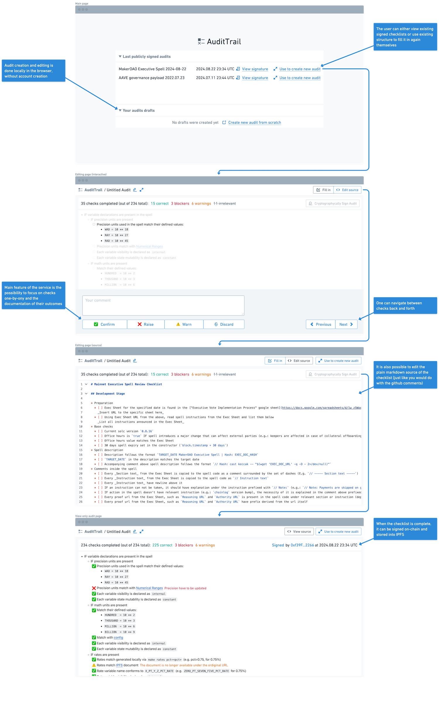

# AuditTrail

AuditTrail is a tool to facilitate filling in repetitive checklists and publicly sign them when they are complete. Born from the actual experience of fulfilling operational security role at MakerDAO, the tool is designed to be applicable beyond crypto ecosystem. The page allows anyone to go through a checklist and, compared to a regular "todo", react to each checked item via one of the multiple options (indicating each specific check is either correct, incorrect, acceptable or not applicable). When all checks are complete, the user can sign the checklist, which will allow publicly share the results of the inspection.

⚙️ Built using [NextJS](https://nextjs.org/), [React](https://react.dev/), [remark](https://github.com/remarkjs/remark), and [Sign protocol](https://sign.global/).

### Design of the application flow

